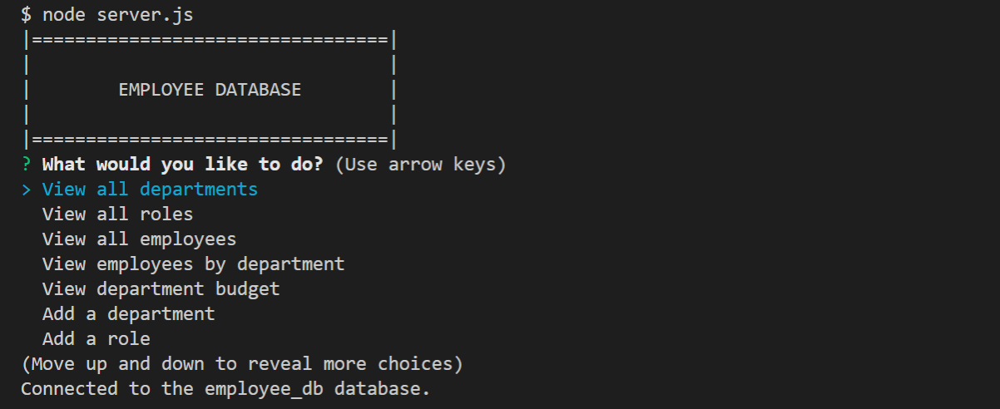
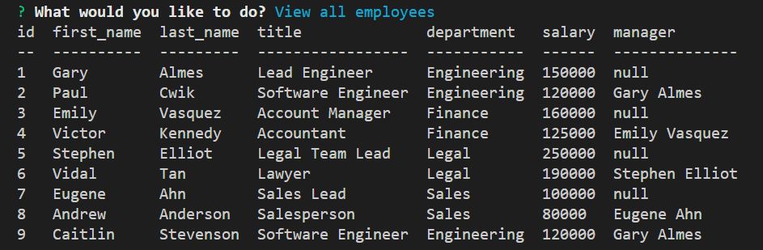

# Employee Management System
 

* An employee management system that allows users to manage their company's employee database:
* Built using Node.js and uses the following packages:
    - [Inquirer package](https://www.npmjs.com/package/inquirer)
    - [MySQL2 package](https://www.npmjs.com/package/mysql2)
    - [console.table package](https://www.npmjs.com/package/console.table)

<br>

## Installation

* To use this application, you need to have Node.js installed.

* To run the app locally:
    1. Clone this repository.
    2. Open up your terminal, navigate to the folder path, and enter the following command to install all dependencies:<br>
    ```npm i```
    3. Enter ```node server.js``` to start running the application.

<br>

## Usage

* The application is extremely user-friendly. Use arrow keys to move up and down.
* You will be presented with a series of options to navigate the employee database. Some will require user input to display information.

    - View all departments
    - View all roles
    - View employees by department
    - View department budget
    - Add a department
    - Add a role
    - Add an employee
    - Update an employee role
    - Delete department
    - Delete role

<br>
<p align="left">
    
</p>
<br>

<br>
<p align="left">
    
</p>
<br>

<p align="center">
    <i>Walkthrough video</i>
</p>
<br>

https://user-images.githubusercontent.com/97539424/161875817-900269ca-c895-4ec7-bb62-24ed4790577c.mp4

<br>

## License
This code is licensed under [MIT License](https://mit-license.org/).

<br>

## Tests
This application has no tests as of the moment.
<br>

<hr>

## Questions
If you have any questions, please don't hesitate to contact:
 * Github - [github.com/nvsco-10](https://github.com/nvsco-10)
 * Email - neemavelasco@gmail.com


